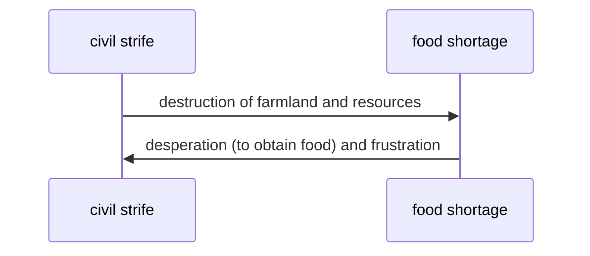

# Reasons for food shortages
## Terms
**Food security**
~ state of having reliable access to a sufficient quantity of affordable, nutritious food

| Topic          | Sub-topic |
| -------------- | --------- |
| [[#Physical]]  | [[#Climate change]], [[#Extreme weather events]], and [[#Pests]]          |
| [[#Political]] |[[#Civil strife]] and [[#Poor governance]]           |
| [[#Economic]]  | [[#Rising demand from emerging economies]], [[#Rising costs of fertilisers and transport]], and [[#Conversion of farmland to industrial crop production]]          |
| [[#Social]]   |[[#Lack of accessibility]], [[#Inadequate logistics of food distribution and storage]], and [[#Rapid population growth]]           |
## Physical
Includes:
- [[#Climate change]]
- [[#Extreme weather events]]
- [[#Pests]]
### Climate change
refers to variation in **global climate patterns** in **long term**

==Affects food supply by==
- 👎 cause existing farmland to be unsuitable for farming 
- 👎 lengthen growing season in some countries 
- 👍 make some land suitable for farming which are previously unsuitable for farming 
>[!success] Positives
>1. Rising temp. is EXPECTED to $\uparrow$ increase food production of up to ==35%== in ==China== 
>     - Growing seasons are longer in cool areas
>     - Now, growing seasons are shorter due to increased warmth
>2. **Seasonal melting of glaciers** $\uparrow$ increase water supply in ==India== and ==China==
>     - India and China requires water supply for **irrigation** during **dry seasons**

>[!fail] Negatives
>1. Rising temp. is EXPECTED to $\downarrow$ decrease food production of up to ==50%== in Southeast Asia
>     - Growing seasons are faster in warmer areas
>     - Now, growing seasons are shorter as temperature is too high
>2. Shrinking of glaciers in ==Himalayas== $\downarrow$ decrease water supply for nearby farmers
>     - With $\downarrow$ decrease in water supply, crops will receive $\downarrow$ lesser water
>     - $\downarrow$ decrease in harvest
> 3. Rising sea levels flood ==fertile coast lands==
>     - loss of fertile (coast) lands
> 4. $\uparrow$ increase in [[#Pests]]
>     - rising temp. is ==favourable== to the growth of pests ($\uparrow$ warmth)
### Extreme weather events
will be more frequent due to [[#Climate change]]
E.g.:
- droughts
- cold waves
- heat waves
- tropical cyclones

==Affects food supply by==
- droughts: reduce water supply for crops (*difficult for plants to grow*)
- tropical cyclones: flooding and thereby destruction of farmland (*damage of crops*)
>[!example] ==Cyclone Yasi== struck ==Queensland, Australia== and ==1/2== of state's crops, like ==bananas==, were damaged
### Pests
E.g.:
- wild rabbits
- moles
- insects
$\uparrow$ damage food crops (due to pests)
$\downarrow$ crop yield
$\rightarrow$ food shortage
>[!example] ==Caterpillar== invasion in ==Liberia==
>Invasion affected ==~100== villages in Liberia
>$\rightarrow$ **major threat** to the already serious **food security** situation in Liberia
## Political
Includes:
- [[#Civil strife]]
- [[#Poor governance]]
### Civil strife
refers to situations in which a country faces **major internal conflicts**
E.g.:
- riot
- social unrest
- civil war

**Destruction of farmlands**
Landmines planted on farmlands during civil war
$\rightarrow$ dangerous for farmers to farm there
$\rightarrow$ **lesser** or no **farmers** willing to farm there
$\rightarrow$ **reduction** or **stop** in food production **during** and **after** conflict

**Destruction of resources**
Disputes over control of resources (e.g. water)
$\rightarrow$ resources may be destroyed
$\rightarrow$ food production hindered

### Poor governance
refers to the **poor exercise of economic and political authority** to manage the country's affairs
E.g.:
- corruption
- policy errors
- inability to implement policies
>[!example] Poor governance in ==Madhya Pradesh, India==
>govt. failed to anticipate future problems
>$\rightarrow$ In ==2010==, ==40 000 villagers== deprived of land for farming due to development of mining
>$\rightarrow$ loss of means for villagers to produce food for themselves
>$\rightarrow$ only can buy food using very limited income
## Economic
Includes:
- [[#Rising demand from emerging economies]]
- [[#Rising costs of fertilisers and transport]]
- [[#Conversion of farmland to industrial crop production]]
### Rising demand from emerging economies
**Emerging economies**
refers to LDCs with developing economies that ==grow at rates== that allow them to contribute significantly to ==global economy==
E.g.: ==BRIC==
- ==B==razil
- ==R==ussia
- ==I==ndia
- ==C==hina

These countries have
- $\uparrow$ rapidly growing middle class
- $\uparrow$ growing purchase power
- [[Changing food preferences]]
which result in
$\uparrow$ demand for food (esp. meat and dairy)
$\downarrow$ food inventories
$\rightarrow$ food shortage in **LDCs** (compounded by the fact that they have $\downarrow$ food supply)

### Rising costs of fertilisers and transport
$\uparrow$ **cost of fertilisers**
$\uparrow$ cost of food production
$\uparrow$ food prices
(to $\uparrow$ increase OR $=$ maintain ==profit==)

$\uparrow$ use of petroleum products by modern agriculture
(to fuel machinery and for transportation)
$\uparrow$ fuel prices
$\uparrow$ **transport prices** & machine operation costs
$\uparrow$ food prices + **cost of fertilisers** (transporting fertilisers)
(to $\uparrow$ increase OR $=$ maintain ==profit==)

The poor use a large portion of their income to buy food. So when
$\uparrow$ food prices
$\downarrow$ affordability of food
$\rightarrow$ cannot afford as much food
$\rightarrow$ food shortage (for the **poor**)

### Conversion of farmland to industrial crop production
$\uparrow$ farmlands converted from ==growing crops for food== to ==growing **crops** for **biofuels**==
$\downarrow$ farmlands growing crops for food 
$\downarrow$ food production

**Biofuels**
are fuels that derive energy from ==biological carbons==

**Crops used for biofuels** include:
- corn
- sugar cane
- palm oil
>[!example] ==25%== of all food crops grown in ==USA== becomes fuel for vehicles
>The same amount of food crops could feed 330 million people for 1 year
>
## Social
Includes:
- [[#Lack of accessibility]]
- [[#Inadequate logistics of food distribution and storage]]
- [[#Rapid population growth]]
### Lack of accessibility
**Food accessibility**
refers to how easily ==consumers== can reach ==food retail outlets== (e.g. shops & supermarkets)
- depends on
    - ==number== of food outlets
    - ==location== of food outlets
    - quality of ==transport network== (e.g. well-linked roads)

Food can be available in a country, but can be inaccessible to some people. For example,
>[!example] Food outlets are ==few== and ==far apart== from one another in LDCs
> $\rightarrow$ people cannot obtain fresh produce in ==timely manner== (due to inaccessibility)
> $\rightarrow$ food security threatened
### Inadequate logistics of food distribution and storage
**Food distribution**
- refers to movement of food from ==farms== to ==food retail outlets==
- depends on quality of ==transport network== (e.g. well-linked roads)
- affected by
    - physical barriers (e.g. mountains etc.)
    - events (e.g. landslides, earthquakes, etc.)
- especially prevalent in ==remote communities== where
> local production < local demand

### Rapid population growth
$\uparrow$ growing population
$\uparrow$ growing demand for food
$\rightarrow$ ==food supply== may be unable to meet $\uparrow$ g==rowing demand for food==
>[!example] By ==2025==, ==75%== of ==Sub-Saharan Africans== have to rely on **food aid**
>Due to [[#Climate change]], $\downarrow$ declining of arable land
>With rapid population growth, **food production** and **food security** will be threatened

---
# Backlink(s)
1. [[Food and Resources]]