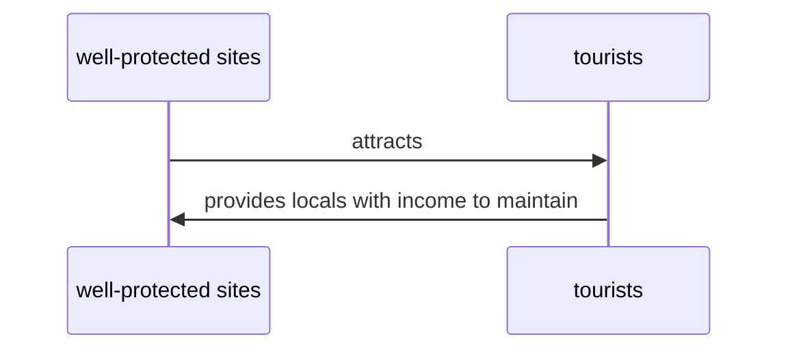

# Management of impacts of tourism
$\rightarrow$ refers to decision-making that benefits both ==natural environment== (which is visited by tourists) and ==local population
$\rightarrow$ minimise/avoid damage to environment==
$\rightarrow$ ensure natural environment can be ==sustained== for future generations

## Sustainable tourism
Tourism that doesn't
- cause damage to environment
- leave negative impacts on economy, culture, and environment of the destination

However, doing so might deter tourists from visiting. So, these are what tourists sites can do:
- train locals to perform skilled tourism jobs
- locals develop homestay accommodation (where tourists pay locals directly for accommodation) 🏠
- promote local food (local food producers can improve business) 🥫
- 
## Conservation of fragile environments
$\rightarrow$ refers to careful management and use of ==resources== (resources are limited $\rightarrow$  cannot be depleted)
$\rightarrow$ important for ==fragile environments== (easily affected by change)
- e.g. tourists dump wastes into sea $\rightarrow$  damage coral reefs (Recall [[Impacts of tourism#^886da9]])
$\rightarrow$ can be facilitated using ==laws and regulations== + ==support== from local population
>[!example] UNESCO funds threatened sites in order to conserve them

### Positive feedback loop

## Measures for managing tensions
Agencies and organisations can be set up to impose measures to balance ==needs of tourists== and ==needs of locals and environment==. E.g.
- limit no. of visitors (minimise congestion, degradation, etc. (recall [[Impacts of tourism#Environmental]]]))
- employ staff to
    - maintain and repair site
    - prevent tourists from damaging environment
- discuss with locals $\rightarrow$ find out about their needs and concerns
- restrict tourists from going to some places (where only locals can)

Although locals may be happy,
- business owners may not be due to $\downarrow$ business worsening
- $\downarrow$ job for locals

---
# Backlink(s)
1. [[Global Tourism]]